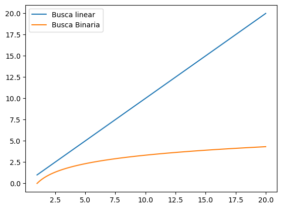

# Aluno: Félix Luiz Garção Filho			
## Matrícula: 20230024216

# Gerais:
1. **TAD’s são definições e operações de um conjunto de dados, mas sem definirem como são implementados a fundo. (Ex: uma lista). ED’s por outro lado possuem detalhamento preciso sobre suas implementações (Ex: uma lista ligada).**

2. **B) Deque, lista simplesmente ligada, pilha e fila.**
3. **B) A fila: tipo especial de lista encadeada, tal que o primeiro objeto a ser inserido na fila é o primeiro a ser lido; nesse mecanismo, conhecido como estrutura FIFO (First In- First Out), a inserção e a remoção são feitas em extremidades contrárias e a estrutura deve possuir um nó com a informação (recorde) e um apontador, respectivamente, para o próximo nó.**
4. **A)uma fila que processa primeiro os eventos mais antigos.**
---

# Listas:
1. 
## Implementação ArrayList

```Go
type ArrayList struct {
    v []int
    inserted int
}

func (l *ArrayList) Init(size int) {
    l.v = make([]int, size)
}

func (list *ArrayList) Size() int {
    return list.inserted
}

func (list *ArrayList) Get(index int) (int,error) {
    if index >=0 && index < list.inserted {
        return list.v[index], nil
       
    }
    return -1, errors.New(fmt.Sprintf("Index invalido: %d", index))
   
}


func (list *ArrayList) Add(e int) {
    if list.inserted == len(list.v) {
        list.doubleV()
    }
    list.v[list.inserted] = e
    list.inserted++
}

func (list *ArrayList) AddOnIndex(e, index int) error {
    if index >=0 && index <= list.inserted {
        if list.inserted == len(list.v) {
            list.doubleV()
        }
        for i := list.inserted; i > index; i-- {
            list.v[i] = list.v[i-1]
        }
        list.v[index] = e
        list.inserted++
        return nil
    }
    return errors.New(fmt.Sprintf("Indice invalido: %d", index)) 
}

func (list *ArrayList) doubleV(){
    newSize := len(list.v) * 2
    if newSize == 0 {
        newSize = 1
    }
    newV := make([]int, newSize)
    for i := 0; i < len(list.v); i++ {
        newV[i] = list.v[i]
       
    }
    list.v = newV
}

func (list *ArrayList) RemoveOnIndex(index int) error {
    if index >=0 && index < list.inserted {
        for i := index; i < list.inserted-1; i++ {
            list.v[i] = list.v[i+1]        
        }
        list.inserted--
        return nil
    }
    return errors.New(fmt.Sprintf("Indice invalido: %d", index))
        
}

func (list *ArrayList) Set(e int, index int) error {
    if index >= 0 && index < list.inserted {
        list.v[index] = e
        return nil
    }
    return errors.New(fmt.Sprintf("Indice invalido: %d", index))
         
}
```
---
## LinkedList

```Go
type Node struct{
	val int
	next *Node
}

type LinkedList struct {
	head *Node
	inserted int
}

func (list *LinkedList) Size() int {
	return list.inserted
}

func (list *LinkedList) Get(index int) (int, error) {
	if index >=0 && index < list.inserted {
		aux := list.head
		for i := 0; i<index; i++ {
			aux = aux.next
		}
		return aux.val, nil
	}
	return -1, errors.New(fmt.Sprintf("Index invalido: %d", index))
	
} 

func (list *LinkedList) Add(e int) {

	// cria novo node, fazendo seu next apontar pra nada, depois percorre a lista ate 
	// chegar no ultimo elemento e faz seu next apontar pro novo node

	Novo := &Node{
		val : e,
		next : nil,
	}

	if list.head == nil {
		list.head = Novo
		list.inserted++
		return
	}
	aux := list.head
	
	for aux.next != nil { 
		aux = aux.next
	}
	aux.next = Novo
	list.inserted ++
	return
}

func (list *LinkedList) AddOnIndex(e, index int) error {
	if index >=0 && index <= list.inserted {
		Novo :=&Node{
			val : e,
			next : nil,
		}

		if index == 0 {
			// inserção no começo
			Novo.next = list.head
			list.head = Novo
			list.inserted++
			return nil
		}
		if index == list.inserted {
			list.Add(e)
			return nil
		}
		// inserção no meio
		aux := list.head
		for i := 0; i<index-1 ; i++{
			aux = aux.next
		}
		Novo.next = aux.next
		aux.next = Novo

		list.inserted++ 
		return nil
	} 
	
	return errors.New(fmt.Sprintf("Indice invalido: %d", index))

}

func (list *LinkedList) RemoveOnIndex(index int) error {
	if index < 0 || index >= list.inserted {
		return errors.New(fmt.Sprintf("Indice invalido: %d", index))
	}

	if index == 0 {
		// remover o primeiro nó
		list.head = list.head.next
		list.inserted--
		return nil
	}

	// encontrar nó anterior
	anterior := list.head
	for i := 0; i < index-1; i++ {
		anterior = anterior.next
	}

	// pular o nó que será removido
	anterior.next = anterior.next.next

	list.inserted--
	return nil
}

func (list *LinkedList) Set(e, index int) error {
	if index < 0 || index >= list.inserted {
		return errors.New(fmt.Sprintf("Indice invalido: %d", index))
	}

	aux := list.head
	for i := 0; i < index; i++ {
		aux = aux.next
	}
	aux.val = e
	return nil
}


```
---
## DoublyLinkedList

```Go
type Node2P struct {
	val      int
	previous *Node2P
	next     *Node2P
}

type DoublyLinkedList struct {
	head     *Node2P
	tail     *Node2P
	inserted int
}

func (list *DoublyLinkedList) Size() int {
	return list.inserted
}

func (list *DoublyLinkedList) Get(index int) (int, error) {
	if index >= 0 && index < list.inserted {
		if index <= list.inserted/2 {
			aux := list.head
			for i := 0; i < index; i++ {
				aux = aux.next
			}
			return aux.val, nil
		}
		aux := list.tail
		for i := list.inserted-1; i > index; i-- {
			aux = aux.previous
		}
		return aux.val, nil
	}
	return -1, errors.New(fmt.Sprintf("Index invalido: %d", index))
}

func (list *DoublyLinkedList) Add(e int) {

	Novo := &Node2P{
		val:      e,
		next:     nil,
		previous: nil,
	}
	
	if list.head == nil {
		list.head = Novo
		list.inserted++
		return
	}
	
	aux := list.head

	for aux.next != nil {
		aux = aux.next
	}

	aux.next = Novo
	Novo.previous = aux
	list.tail = Novo
	list.inserted++
	

}

func (list *DoublyLinkedList) AddOnIndex(e, index int) error {
	if index < 0 || index > list.inserted {
		return errors.New(fmt.Sprintf("Indice invalido: %d", index))
	}
	
	Novo := &Node2P{
		val: e,
		previous: nil,
		next: nil,
	}

	// inserir no inicio
	if index == 0 {
		Novo.next = list.head
		if list.head != nil {
			list.head.previous = Novo
		}
		list.head = Novo
		if list.tail == nil { // lista tava vazia
			list.tail = Novo
		}
		list.inserted++
		return nil
	}
	// adicionar apos o ultimo elemento
	if index == list.inserted {
		list.Add(e)
		return nil
	}

	var aux *Node2P 
	// inserir na primeira metade
	if index <= list.inserted/2 {
		aux = list.head
		for i:=0; i<index-1; i++{
			aux = aux.next
		}
		Novo.next = aux.next
		Novo.previous = aux
		aux.next.previous = Novo
		aux.next = Novo
		list.inserted++
		return nil
	}
	// inserir na segunda metade
	aux = list.tail
	for i := list.inserted; i > index; i-- {
	aux = aux.previous
	}
	// rouba o previous do aux e passa pro novo, 
	// next do novo tem q apontar pro aux,
	//  e o previous do auxiliar aponta pro novo
	Novo.next = aux.next
	Novo.previous = aux
	aux.next.previous = Novo
	aux.next = Novo
	list.inserted++
	return nil
}

func (list *DoublyLinkedList) RemoveOnIndex(index int) error {
	if index < 0 || index >= list.inserted {
		return errors.New(fmt.Sprintf("Indice invalido %d",index))
	}

	// remover o primeiro
	if index == 0 {
		if list.inserted == 1 {
			list.head = nil
			list.tail = nil
			list.inserted = 0
			return nil
		}
		list.head = list.head.next
		list.head.previous = nil // ja que é o primeiro elemento ele n aponta pra tras
		list.inserted--
		return nil
	}
	// remover o ultimo
	if index == list.inserted-1 {
		list.tail = list.tail.previous
		list.tail.next = nil // ultimo elemento n aponta pra frente
		list.inserted--
		return nil
	}
	var aux *Node2P
	// remover na primeira metade
	if index <= list.inserted/2 {
		aux = list.head
		for i:=0; i<index-1 ; i++ {
			aux = aux.next
		}
		aux.next = aux.next.next
		aux.next.next.previous = aux.next.previous
		list.inserted--
		return nil
	} 
	// remover na segunda metade
	aux = list.tail
	for i:=list.inserted-1; i>index ; i-- {
			aux = aux.previous
	}
	aux.previous.previous.next = aux.previous.next
	aux.previous = aux.previous.previous
	list.inserted--
	return nil
}

func (list *DoublyLinkedList) Set(e, index int) error {
if index < 0 || index >= list.inserted {
		return errors.New(fmt.Sprintf("Indice invalido: %d", index))
	}
	
	var aux *Node2P
	if index <= list.inserted/2 {
		aux = list.head
		for i:=0; i<index; i++ {
			aux = aux.next
		}
		aux.val = e
		return nil
	}
	aux = list.tail
	for i:= list.inserted-1; i>index; i-- {
		aux = aux.previous
	}
	aux.val = e
	return nil
}


```
---

3. **Vantagem: acesso a elementos em qualquer posição com nº de operações constantes.\
Desvantagem: inserção de elementos (se o array tiver cheio, será necessário realocar um espaço e realizar cópias, o que torna o processo custoso)**

4. **Vantagem: inserção e remoção no fim com tempo constante.\
	Desvantagem: Gasto de memória extra para o Node de dois pontos.**

5. 
```Go
    func (list *ArrayList) Reverse() {
	if list.inserted == 0 {
		fmt.Println("Lista vazia")
		return
	}
	for i:=0; i < list.inserted/2; i++ { 
		// a logica aqui eh permutar as pontas e ir aproximando os ponteiros 
		list.v[i],list.v[list.inserted-i-1] = list.v[list.inserted-i-1], list.v[i]
	}
    }
```
6. 
```Go
func (list *LinkedList) Reverse() {
	if list.inserted == 0 {
		return fmt.Println("lista vazia")
	}
	var ant *Node
	var prox *Node
	atual := list.head
	
	for atual != nil {
		prox = atual.next // guarda o proximo elemento da lista
		atual.next = ant // inverte o ponteiro 
		ant = atual // avança o anterior
		atual = prox // avança o atual
	}
	list.head = ant
	return nil

}
```

7. 
```Go
func (list *DoublyLinkedList) Reverse() {
	if list.inserted == 0 {
		fmt.Println("Lista vazia")
		return
	}
	atual := list.head
	var aux *Node2P

	for atual != nil {
		// inverte ponteiros
		aux = atual.previous
		atual.previous = atual.next
		atual.next = aux
		// anda para o próximo (que antes era previous)
		atual = atual.previous
	}

	// permuta head e tail
	list.head, list.tail = list.tail, list.head

}
```
8. **Não faria sentido, pois a Linkedlist não possui um ponteiro que aponta para o último elemento (o Node só possui a referência para o próximo Node).**
---
# Pilhas
1. 
## ArrayStack
```Go
type ArrayStack struct {
	v []int
	top int
}

func (stack *ArrayStack) Init(size int) {
	stack.v = make([]int, size)
}

func (stack *ArrayStack) Size() int{
	return stack.top
}

func (stack *ArrayStack) Peek() (int, error){
	if stack.top == 0 {
		return -1, errors.New("stack vazia")
	}
	return stack.v[stack.top-1], nil
}

func (stack *ArrayStack) Push(value int) {
	if stack.top == len(stack.v) {
		stack.doubleV()
	}
	stack.v[stack.top] = value
	stack.top++

}

func (stack *ArrayStack) Pop() (int, error){
	if stack.top==0 {
		return -1, errors.New("stack vazia")
	}
	stack.top--
	return stack.v[stack.top], nil
}

func (stack *ArrayStack) doubleV(){
	newV := make([] int, len(stack.v)*2)
	for i := 0; i<stack.Size(); i++{
		newV[i] = stack.v[i]
	}
	stack.v = newV
}

func (stack *ArrayStack) IsEmpty() bool {
	return stack.top == 0
}

```
---
## LinkedListStack

```Go
type Node struct{
	val int
	next *Node
}

type LinkedStack struct{
	topo *Node
	qtd int
}

func (stack *LinkedStack) Size() int {
	return stack.qtd
}

func (stack *LinkedStack) Peek() (int,error){
	if stack.qtd == 0 {
		return -1, errors.New("Pilha vazia")
	}

	return stack.topo.val, nil
}

func (stack *LinkedStack) Push(value int) {
	Novo := &Node{
		val: value,
		next: stack.topo,
	}
	stack.topo = Novo
	stack.qtd++
}

func (stack *LinkedStack) Pop() (int,error){
	if stack.qtd == 0 {
		return -1, errors.New("Pilha vazia")
	}
	aux := stack.topo
	stack.topo = stack.topo.next
	stack.qtd --
	return aux.val, nil
}

func (stack *LinkedStack) IsEmpty() bool {
	return  stack.qtd > 0
}
```

3. 
```Go
func balparenteses(par string) bool {
	// cada vez que abre parenteses, 
	// adiciona um na pilha e cada vez q fecha
	// da pop na pilha
	p := &LinkedStack{} 
	for _,ch := range par {
		if ch == '(' { // abriu '('
			p.Push(0) // a pilha so aceita int 
		} else { // fechou ')'
			if p.Size() == 0 {return false} // fechou antes de abrir
			p.Pop() 
		}
	}
	// se for zero quer dizer que todos os 
	// parenteses abertos foram fechados corretamente na ordem
	return p.Size() == 0 
}


```
4. **C) I e II, apenas.**
---
# Filas
1. **Controle de impressão de documentos, onde as requisições são processadas na ordem em que foram enviadas, garantindo que os arquivos sejam impressos conforme a chegada  (característica FIFO). Em sistemas operacionais, filas são empregadas para gerenciar processos prontos para execução, assegurando que sejam executados na ordem correta.**

2. 

## ArrayQueue
```Go
type ArrayQueue struct {
	v     []int
	front int
	rear  int
	
}

func (queue *ArrayQueue) Init(size int) {
	queue.v = make([]int, size)
	queue.front = -1
	queue.rear = -1
}

func (queue *ArrayQueue) Size() int {
	if queue.front == -1 && queue.rear == -1 { // fila vazia
		return 0
	}
	if queue.rear >= queue.front { // nao deu a volta
		return queue.rear - queue.front + 1
	}
	return len(queue.v) - queue.front + queue.rear + 1 // deu a volta
}

func (queue *ArrayQueue) Enqueue(val int) {
	if queue.front == -1 && queue.rear == -1 { // fila vazia
		queue.front++
		queue.rear++
	} else {
		queue.rear = (queue.rear + 1) % len(queue.v)
	}
	queue.v[queue.rear] = val
}

func (queue *ArrayQueue) Dequeue() (int, error) {
	if queue.front == -1 && queue.rear == -1 {
		return -1, errors.New("Fila vazia")
	}
	val := queue.v[queue.front]
	if queue.front == queue.rear { // unico elemento na fila
		queue.front, queue.rear = -1, -1
		return val, nil
	}

	// avanço circular
	queue.front = (queue.front + 1) % len(queue.v)
	return val, nil
}

func (queue *ArrayQueue) Front() (int, error) {
	if queue.front == -1 && queue.rear == -1 {
		return -1, errors.New("Fila vazia")
	}
	return queue.v[queue.front], nil
}

func (queue *ArrayQueue) IsEmpty() bool {
	return queue.front == -1 && queue.rear == -1
}
```
---
## LinkedListQueue

```Go
type Node struct {
	val int
	next *Node
}

type LinkedQueue struct{
	inserted int
	front *Node
	rear *Node
}

func (queue *LinkedQueue) Size() int{
	return queue.inserted
}

func (queue *LinkedQueue) Enqueue(value int) {
	novo := &Node{
		val: value,
		next: nil,
	}
	if queue.inserted == 0 {
		queue.front, queue.rear = novo,novo
		
	}else { 
		queue.rear.next = novo
		queue.rear = novo
	}
	queue.inserted++


}

func (queue *LinkedQueue) Dequeue() (int,error) {
	if queue.inserted == 0 {
		return -1,errors.New("fila vazia")
	}
	val := queue.front.val
	if queue.inserted == 1 {
		queue.front, queue.rear = nil,nil
	}else {
		queue.front = queue.front.next
	}

	queue.inserted--
	return val,nil
}

func (queue *LinkedQueue) Front() (int,error) {
 if queue.inserted ==0 {
	return -1, errors.New("fila vazia")
 }
 val := queue.front.val
 return val, nil
 
}

func (queue *LinkedQueue) IsEmpty() bool {
	return queue.inserted == 0
}
```
---
4. **Size() Já está implementada desse jeito na questão acima**
---

# Deque
1. **Gerenciamento do histórico de navegação em navegadores ou o histórico de ações em editores de código, como o VS Code, onde é possível desfazer ou refazer ações com base na sequência de operações realizadas. Além disso, deques são utilizados como base para funções importantes em sistemas operacionais, como o agendamento de tarefas.**

2. 
## ArrayDeque
```Go
func (deque *ArrayDeque) Init(size int) {
	deque.v = make([]int,size)
	deque.front, deque.rear = -1,-1
}

func (deque *ArrayDeque) Size() int {
	if deque.front == -1 && deque.rear == -1 { // fila vazia
		return 0
	}
	if deque.rear >= deque.front { // nao deu a volta
		return deque.rear - deque.front + 1
	}
	return len(deque.v) - deque.front + deque.rear + 1 // deu a volta
}

func (deque *ArrayDeque) doubleV() {
	n := len(deque.v)
	newV := make([]int, n*2)
	size := deque.Size()
	i := deque.front
	for j := 0; j < size; j++ {
		newV[j] = deque.v[i]
		i = (i + 1) % n
	}
	deque.v = newV
	deque.front = 0
	deque.rear = size - 1
}

func (deque *ArrayDeque) EnqueueFront(value int) {
	if deque.Size() == len(deque.v){
		deque.doubleV()
	}
	if deque.Size() == 0 {
		deque.rear++
		deque.front++
	} else { // ja tem elementos inseridos
		if deque.front - 1 == -1 { // se front esta no 0
        deque.front = len(deque.v)-1 // vai pra ultima pos(circula)
    	} else {
        	deque.front--
    	}

	}

	deque.v[deque.front] = value
}

func (deque *ArrayDeque) EnqueueRear(value int) {
	if deque.Size() == len(deque.v){
		deque.doubleV()
	}
	if deque.Size() == 0 {
		deque.rear++
		deque.front++
	} else {
		deque.rear = (deque.rear+1) % len(deque.v)
	}
	deque.v[deque.rear] = value
}

func (deque *ArrayDeque) DequeueFront() (int, error) {
	if deque.Size() ==0 {
		return -1, errors.New("fila vazia")
	}
	val := deque.v[deque.front]
	if deque.rear == deque.front { // so um elemento na fila
		deque.rear, deque.front = -1, -1
	} else {
		deque.front = (deque.front+1) % len(deque.v)
	}
	return val, nil

}

func (deque *ArrayDeque) DequeueRear() (int, error) {
	if deque.Size() ==0 {
		return -1, errors.New("fila vazia")
	}
	val := deque.v[deque.rear]
	if deque.rear == deque.front { // so um elemento na fila
		deque.rear, deque.front = -1, -1
	} else {
		if deque.rear == 0 { // se estava no começo do array, circula pro final
			deque.rear = len(deque.v) - 1
		} else {
			deque.rear--
		}
	}
	return val, nil
}

func (deque *ArrayDeque) Front() (int, error) {
	if deque.Size() ==0 {
		return -1, errors.New("fila vazia")
	}
	val := deque.v[deque.front]
	return val, nil
}

func (deque *ArrayDeque) Rear() (int, error) {
	if deque.Size() ==0 {
		return -1, errors.New("fila vazia")
	}
	val := deque.v[deque.rear]
	return val, nil
}

func (deque *ArrayDeque) IsEmpty() bool {
	return deque.Size() == 0
}

```
---
## LinkedDequeue

```Go
type Node2P struct {
	val  int
	prev *Node2P
	next *Node2P
}

type Deque struct {
	head     *Node2P
	tail     *Node2P
	inserted int
}

func (d *Deque) Size() int {
	return d.inserted
}

func (d *Deque) EnqueueBack(e int) {
	Novo := &Node2P{
		val: e,
	}
	if d.inserted == 0 {
		d.head, d.tail = Novo, Novo
	}
	Novo.prev = d.tail
	d.tail = Novo
	d.inserted++
}

func (d *Deque) EnqueueFront(e int) {
	Novo := &Node2P{
		val: e,
	}
	if d.inserted == 0 {
		d.head, d.tail = Novo, Novo
	}
	Novo.next = d.head
	d.head = Novo
	d.inserted++
}

func (d *Deque) DequeueFront() (int, error) {
	if d.inserted == 0 {
		return -1, errors.New("deque vazio")
	}
	val := d.head.val
	if d.inserted == 1{
		d.head, d.tail = nil,nil
		d.inserted--
		return val, nil
	}
	d.head = d.head.next
	d.head.prev = nil
	d.inserted--
	return val, nil
}

func (d *Deque) DequeueBack() (int, error) {
	if d.inserted == 0 {
		return -1, errors.New("deque vazio")
	}
	val := d.tail.val
	if d.inserted == 1{
		d.head, d.tail = nil,nil
		d.inserted--
		return val, nil
	}
	d.tail = d.tail.prev
	d.tail.next = nil
	d.inserted--
	return val, nil
}

func (d *Deque) Rear() (int, error) {
	if d.inserted == 0 {
		return -1, errors.New("deque vazio")
	}
	return d.tail.val, nil
}

func (d *Deque) Front() (int, error) {
	if d.inserted == 0 {
		return -1,errors.New("deque vazio")
	}
	return d.head.val, nil
}

func (d *Deque) IsEmpty() bool {
	return d.inserted == 0
}


```
---
# Algoritmos de busca
1. **A busca linear é implementada de forma que ela percorre individualmente cada elemento da estrutura de dados, comparando cada um deles com o valor alvo, e é útil para buscas em estruturas que não estão ordenadas. A busca binária consiste em dividir a estrutura de dados em estruturas menores com metade dos elementos que possuia antes. Porém seu uso é limitado apenas em estruturas que já estão ordenadas, o que a torna com uma aplicabilidade muito especifica.**

2. **A busca linear tem complexidade O(n) pois precisa percorrer toda a estrutura. Por outro lado, a busca binária tem Complexidade O(Log(n)), pois sempre vai quebrando a estrutura ao meio para buscar o elemento desejado**


3. 
```Go
func bin_search(v []int, e int, ini int, fim int) int{
	if ini > fim {return -1}

	mid := (fim+ini)/2
	if v[mid] == e {
		return mid
	} else if v[mid] > e { //ta na primeira metade
		return bin_search(v,e,ini,mid-1) // mid-1 pq ja checou o mid

	}else{ // segunda metade
		return bin_search(v,e,mid+1,fim)
	}
	
}
```