# Aluno: Félix Luiz Garção Filho			
## Matrícula: 20230024216

# AVL:

## 1. é uma propriedade da AVL que se diz respeito ao seu balanceamento. se uma arvore é balanceada entao seus nós possuem fator de balanço entre -1 a +1. O bf se calcula fazendo a diferença entre a subarvore esquerda e direita.

## 2. uma bst não necessariamente é balanceada. Para a AVL, a diferença entre as alturas das subárvores esquerda e direita de qualquer nó não pode ser maior que um, ja a bst não obedece esse criterio. toda AVL é uma BST mas nem toda BST é uma AVL

## 3. BSTS têm desempenho médio de O($log_n$) para busca, inserção e remoção, mas podem degradar para O(n) no pior caso se ficarem desequilibradas. AVLs são BSTs balanceadas, garantindo sempre O($log_n$) em todas as operações, pois mantêm a diferença de altura entre subárvores em no máximo 1, corrigindo desbalanceamentos com rotações após inserções/remoções.

## 4.


## 5.
```go
func (root *Node) RotRight() *Node{
    newRoot := root.left
    root.left = newRoot.right
    newRoot.right = root

    return newRoot

}
```

## 6. Retornar um node garante que a árvore reflita corretamente todas as alterações estruturais feitas. Retornar o novo nó permite que o pai atualize corretamente seu ponteiro para o filho modificado, mantendo a árvore consistente.

## 7.
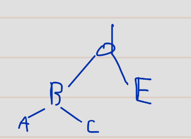
## 8.

```go
func (root *Node) RotLeft() *Node {
	newRoot := root.right
	root.right = newRoot.left
	newRoot.left = root

	return newRoot
}
```

## 9.
- na questao 4: primeiro atualiza as propriedades do nó raiz (Nó D), após isso atualiza as propriedades do novo Nó raiz(Nó B)

- na questao 7: primeiro atualiza as propriedades do nó raiz (Nó B), após isso atualiza as propriedades do novo Nó raiz(Nó D)

## 10.
```go
func (root *Node) UpdateProperties() {
	hl := 0
	hr := 0
	if root.left != nil {
		hl = root.left.height
	}
	if root.right != nil {
		hr = root.right.height
	}
	root.bf = hr - hl
	if root.left == nil && root.right == nil { // no eh folha
		root.height = 0
	} else if hl > hr {
		root.height = hl + 1
	} else {
		root.height = hr + 1
	}

}
```

## 11.
```go
func (root *Node) RotRight() *Node {
	newRoot := root.left
	root.left = newRoot.right
	newRoot.right = root

	root.UpdateProperties()
	newRoot.UpdateProperties()

	return newRoot

}

func (root *Node) RotLeft() *Node {
	newRoot := root.right
	root.right = newRoot.left
	newRoot.left = root
	root.UpdateProperties()
	newRoot.UpdateProperties()

	return newRoot
}
```

## 12.
- esquerda-neutro
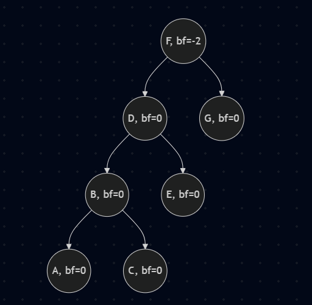
- esquerda-direita
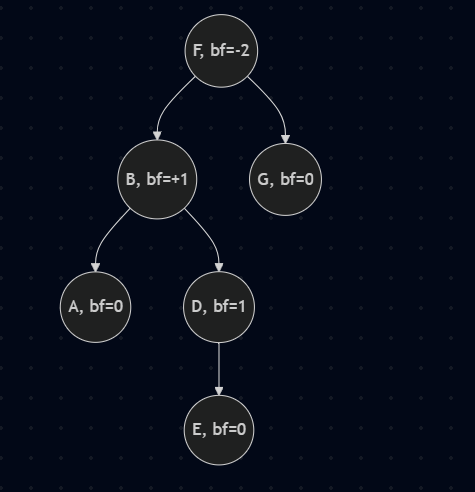
- direita-direita
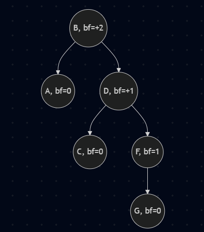
- direita-neutro
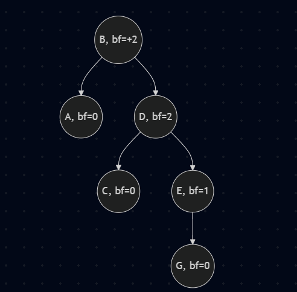
- direita-esquerda
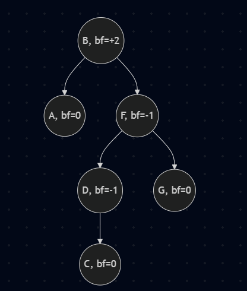

## 13.
```go
func (root *Node) RebalanceLeftLeft() *Node {
	return root.RotRight()
}

func (root *Node) RebalanceLeftNeutral() *Node {
	return root.RotRight()
}

func (root *Node) RebalanceLeftRight() *Node {
	root.left = root.left.RotLeft()
	return root.RotRight()
}

func (root *Node) RebalanceRightRight() *Node {
	return root.RotLeft()
}

func (root *Node) RebalanceRightNeutral() *Node {
	return root.RotLeft()
}

func (root *Node) RebalanceRightLeft() *Node {
	root.right = root.right.RotRight()
	return root.RotLeft()

}

```


## 14. Retornar um node garante que a árvore reflita corretamente todas as alterações estruturais feitas. Retornar o novo nó permite que o pai atualize corretamente seu ponteiro para o filho modificado, mantendo a árvore consistente.

## 15.
```go
func (root *Node) Rebalance() *Node {
	// checa o fator de balanço e rebalanceia
	if root.bf < -1 { // torta para a esquerda
		if root.left.bf <= 0 { // casos Left-Left e Left-Neutral
			return root.RebalanceLeftLeft() // nao precisa de uma func RebalanceLeftNeutral
		} else { // caso Left-Right
			return root.RebalanceLeftRight()
		}
	} else if root.bf > 1 { // torta para a direita
		if root.right.bf >= 0 { // casos Right-Right e Right-Neutral
			return root.RebalanceRightRight() // nao precisa de uma func RebalanceRightNeutral
		} else { // caso Right-Left
			return root.RebalanceRightLeft()
		}
	}
	return root // ja ta balanceada
}

```

## 16.

``` go
func (avl *AVL) Add(value int) {
	if avl.root == nil{
		avl.root = createNode(value)
	} else{
		avl.root = avl.root.AddNode(value)
	}

	avl.inserted++
}

func (node *Node) AddNode(value int) *Node{
	if value <= node.value{
		if node.left == nil {
			node.left = createNode(value)
		} else {
			node.left.AddNode(value)
		}
	} else {
		if node.right == nil {
			node.right = createNode(value)
		} else {
			node.right.AddNode(value)
		}
	}

	node.UpdateProperties()
	return node
}
```
## 17.Retornar um node garante que a árvore reflita corretamente todas as alterações estruturais feitas. Retornar o novo nó permite que o pai atualize corretamente seu ponteiro para o filho modificado, mantendo a árvore consistente.

## 18. 
```go
func (avl *AVL) Remove(value int) error{
	if avl.root == nil {
		return errors.New("AVL vazia")
	} else{
		avl.inserted--
		avl.root = avl.root.RemoveNode(value)
		return nil
	}
}
// func auxiliar pra remover um no
func (no *Node) RemoveNode(value int) *Node {
	if value < no.value {
		if no.left != nil {
			no.left = no.left.RemoveNode(value)
			return no
		} else {
			return nil
		}
	} else if value > no.value {
		if no.right != nil {
			no.right = no.right.RemoveNode(value)
			return no
		} else {
			return nil
		} 
	} else {
		if no.left == nil && no.right == nil {
			return nil
		} else if no.left != nil && no.right == nil {
			return no.left
		} else if no.left == nil && no.right != nil {
			return no.right
		}else{
			max := no.left.Max()
			no.value = max
			no.left = no.left.RemoveNode(max)
			return no
		}
	}
	no.UpdateProperties()
	return no.Rebalance()
}

```

## 19. pois garante que a árvore reflita corretamente todas as alterações estruturais feitas. Retornar o novo nó permite que o pai atualize corretamente seu ponteiro para o filho modificado, mantendo a árvore consistente.

## 20. 
```go
func (no *Node) IsAVL() bool {
    if no == nil {
        return true
    }
    if no.bf <= -2 || no.bf >= 2 {
        return false
    }
    return no.left.IsAVL() && no.right.IsAVL()
}
```
## 21. F,E,L,I,X,U,Z
-> ao inserir o U na AVL, temos um caso de desbalanceamento(direita-direita). portanto precisamos girar a raiz para a esquerda para resolver esse problema. dessa forma L se torna a nova raiz, F passa a ser a raiz à esquerda e I será seu filho a direita. Após isso, a arvore estará balanceada

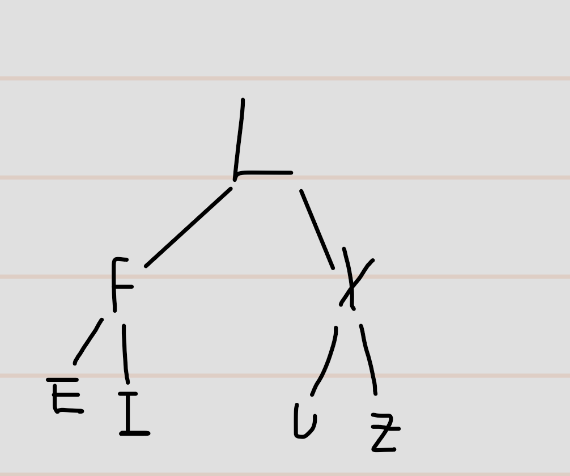

## 22. A)

# Tabela hash
## 1. array

## 2. Chaves que possuem o formato numérico já possuem a função de hash implementada. Se uma chave não possui formato numérico, então devemos especificar a função hash a partir de seus atributos


## 3. 
```go
type Map interface {
	Put(key int, value string)
	Get(key int) (string, error)
	Remove(key int)
	Size() int
	LoadFactor() float32
	Init()
}
```
## 4.
```go
type Tuple struct {
    // estrutura auxiliar para guardar o par
    // (key,value) dentro dos buckets
	key   int
	value string
}

type HashTable struct {
	buckets          [][]Tuple
	elementsInserted int
}
```

## 5. Colisoes são quando a função hash calcula o mesmo índice para dois dados diferentes. para resolver existem os endereçamentos aberto e fechados.
- Encadeamento (end. fechado): Adiciona os elementos numa lista externa.
- Endereçamento aberto: Procura um outro lugar vazio e põe o dado lá. Isso pode ser feito usando o proximo indice do vetor(linear), Se colidiu na casa X, tenta X + 1², X + 2²,..., (Quadratico), ou fazendo hashing duplo.

## 6.
```go
func (table *HashTable) Put(key int, value string) {
	if table.LoadFactor() > 0.75{
		table.increaseBuckets()
	}
	put(table.buckets, key, value)
	table.elementsInserted++
}

func put(buckets [][]Tuple, key int, value string){
	bucket := key % len(buckets) 
	buckets[bucket] = append(buckets[bucket], Tuple{
		key: key, 
		value: value})
	
}

func (table *HashTable) increaseBuckets() { 
	// literalmente a mesma coisa de alocacao dinamica de memoria
	increasedBuckets := make([][]Tuple, 8*len(table.buckets))
	for i:=0; i<len(table.buckets); i++{
		for _, tuple := range table.buckets[i] {
			put(increasedBuckets, tuple.key, tuple.value)
		}
	}
	table.buckets = increasedBuckets 
}

func (table *HashTable) LoadFactor() float32{
	return float32(table.elementsInserted) / float32(len(table.buckets))
}

func (table *HashTable) Get(key int) (string, error){
	bucket := key % len(table.buckets) 
	for _, tuple := range table.buckets[bucket] {
		if tuple.key == key{
			return tuple.value, nil
		}
	}
	return  " ", errors.New("a tabela nao possui essa chave")
}

func (table *HashTable) Remove(key int) error{
	bucket := key % len(table.buckets) 
	index := -1
	for i, tuple := range table.buckets[bucket]{
		if tuple.key == key {
			index = i
			break
		}
	}
	if index == -1 {
		return errors.New("a tabela nao possui essa chave")
	} else {
		// daria pra usar copy e outras fulerage aq, mas parece q esse eh o melhor jeito
		table.buckets[bucket] = append(table.buckets[bucket][:index], table.buckets[bucket][index+1:]...)
		table.elementsInserted--
		return nil
	}
}

func (table *HashTable) Size() int {
	return table.elementsInserted
}

func (table *HashTable) Init(size int) {
	table.buckets = make([][]Tuple, size)
	table.elementsInserted = 0
}
```

# Heap

## 1. A fila de prioridade é um TAD que permite reajustar a ordem dos elementos que ela contém com base na prioridade dos seus elementos. Heap é uma ED específica que organiza os dados de forma que o elemento de maior (ou menor, depende do criterio) valor esteja sempre acessível instantaneamente na raiz. Suas aplicações sao encontradas em gerenciamento de processos no sistema operacional, algoritmos de grafos (como o de dijkstra)

## 2. 
- Heap de minimo: a raiz será o elemento de menor valor e as folhas os elementos de maior valor. O pai é sempre menor que os filhos
- Heap de maximo: a raiz sera o elemento de maior valoe e as folhas os de menor valor. O pai é sempre maior que os filhos

## 3. 
```go
type PQ interface{
	Add(e int)
	Poll() (int, error)
	Remove(e int) error
	Init()
}
```
## 4. 
```go
type BinaryHeap struct {
	v               []int
	elementsInserted int
}
```

## 5.
```go
 func (heap *BinaryHeap) indexOfParent(index int) int {
	return (index - 1) / 2
}

func (heap *BinaryHeap) indexOfChildren(index int) (int,int) {
	left_child := 2*index + 1
	right_child := 2*index + 2
	return left_child, right_child
}

func (heap *BinaryHeap) bubbleDown(index int) {
	left, right := heap.indexOfChildren(index)
	smallest := index
	
	if left < heap.elementsInserted && heap.v[left] < heap.v[smallest] {
		smallest = left
	}
	if right < heap.elementsInserted && heap.v[right] < heap.v[smallest] {
		smallest = right
	}

	// se n trocou, para
	if smallest == index {
		return
	}

	heap.v[index], heap.v[smallest] = heap.v[smallest], heap.v[index]

	heap.bubbleDown(smallest)
}

func (heap *BinaryHeap) maxHeapify(index int) {
	// se o pai eh menor que o filho, troca
	if index >=0 && index < heap.elementsInserted && heap.v[heap.indexOfParent(index)] < heap.v[index]{
		heap.v[heap.indexOfParent(index)], heap.v[index] = heap.v[index], heap.v[heap.indexOfParent(index)]
		heap.maxHeapify(heap.indexOfParent(index))
	}
}

func (heap *BinaryHeap) Add(value int) {
	if heap.elementsInserted == len(heap.v) {
    	heap.v = append(heap.v, value)
	}
	heap.v[heap.elementsInserted] = value
	heap.elementsInserted++
	heap.maxHeapify(heap.elementsInserted-1)
}

func (heap *BinaryHeap) Poll() (int,error) {
	if heap.elementsInserted == 0 {
		return -1,errors.New("Heap vazia")
	}
	removed := heap.v[0]
    heap.v[0] = heap.v[heap.elementsInserted-1]
    heap.elementsInserted--
    heap.bubbleDown(0)	
	return removed, nil
}

func (heap *BinaryHeap) Remove(e int) error {
	if heap.elementsInserted == 0 {
        return errors.New("heap vazia")
    }

    
    index := -1
    for i := 0; i < heap.elementsInserted; i++ {
        if heap.v[i] == e {
            index = i
            break
        }
    }

    if index == -1 {
        return errors.New("elemento nao encontrado")
    }

    
    heap.v[index] = heap.v[heap.elementsInserted-1]
    heap.elementsInserted--
    heap.maxHeapify(index)
    heap.bubbleDown(index)

    return nil

}
```

## 6. Heap de minimo antes das operações:
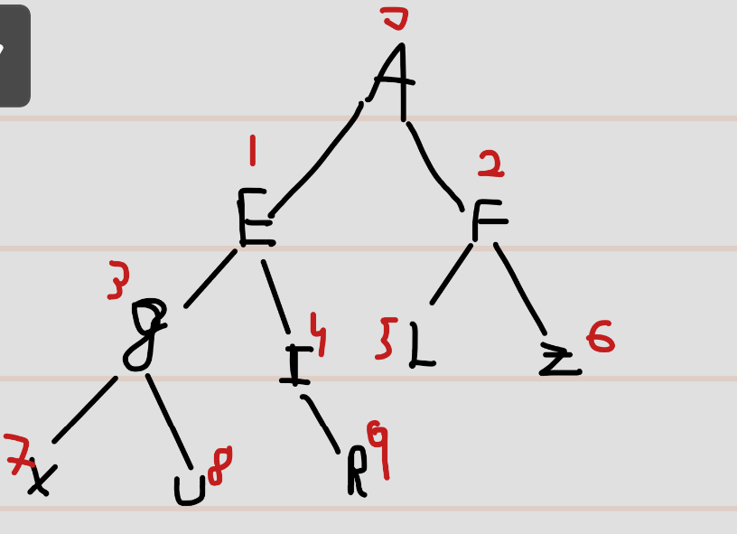
- adicionar o A fará com que o indice 10 do vetor receba o A, e após isso será feita uma flutuação para cima, fazendo com que A ocupe a posição 1(filho de A[pos 0])
- adicionar o Z fará com que o indice 11 do vetor receba o z, e mesmo se chamarmos uma função de flutuação, como temos uma heap de minimo, o Z ficará aonde foi inserido.
- poll(), removemos a raiz e substituimos ela pelo ultimo elemento do array (Z), e entao efetuamos bubble down. o nó vai flutuar até a ultima posição do array, pois eh o elemento de maior valor possivel.
- remover a primeira letra (F): removemos a letra e substituimos o nó pelo ultimo indice do vetor, após isso fazemos a flutuação para baixo, gerando assim a arvore:
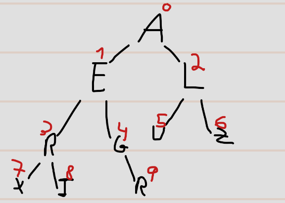

## 7. Heap de maximo antes das operações
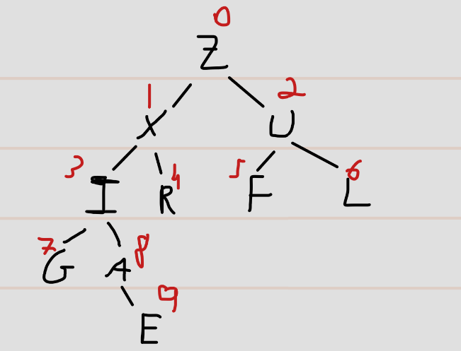
- adicionar o A fará com que o indice 10 do vetor receba o A, e após isso nada vai acontecer pois é uma heap de maximo e o A ja está onde deveria.
- adicionar o Z fará com que o indice 11 do vetor receba o z, apos isso ocorrerá uma flutuação para cima, de modo que ele vai ficar sendo o filho a direita do indice 0.
- poll(), removemos a raiz e substituimos ela pelo ultimo elemento do array que seria o F, e entao efetuamos bubble down. o nó vai flutuar para ser filho de U.
- remover a primeira letra (F): removemos a letra e substituimos o nó pelo ultimo indice do vetor (A) e efetuamos bubble down. assim ficaremos com:
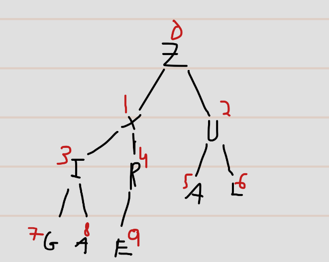